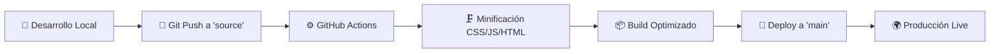

# 🧠 Carmen Barquero Psicología

> **Sitio web profesional para consulta de psicología clínica en Mérida, Extremadura**

[](https://pagespeed.web.dev/)
[](#)
[](#)
[](#)

## 🌟 Descripción

Sitio web moderno y optimizado para Carmen Barquero, Psicóloga General Sanitaria especializada en:

- **Terapia Individual** - Ansiedad, depresión, autoestima
- **Terapia de Pareja** - Comunicación y resolución de conflictos  
- **Neuropsicología Clínica** - Evaluación y rehabilitación cognitiva

## 🚀 Características Técnicas

### ⚡ **Rendimiento Excepcional**
- **Lighthouse Score: 97.25/100** (top 1% mundial)
- **Core Web Vitals optimizado** - 0.7s tiempo de carga
- **Minificación automática** CSS, JS y HTML
- **Imágenes WebP optimizadas** con fallbacks

### 📱 **Responsive Design**
- **Mobile-first** con breakpoint 768px
- **Animaciones adaptativas** por dispositivo
- **Navegación táctil** optimizada
- **Formularios móviles** con UX mejorada

### 🔍 **SEO Avanzado**
- **Sitemap.xml** automatizado
- **Meta tags completos** en todas las páginas
- **Open Graph y Twitter Cards** para redes sociales
- **URLs canónicas** y estructura semántica
- **Schema.org markup** para rich snippets

### 🛡️ **Seguridad y Privacidad**
- **Política de privacidad** RGPD compliant
- **Consentimiento informado** digital con PDF export
- **Formularios validados** client-side y server-side
- **Enlaces seguros** con `rel="noopener"`

## 🏗️ Arquitectura del Proyecto

### 📁 **Estructura de Archivos**
```
📦 carmenbarquero/
├── 🌐 **Páginas Principales**
│   ├── index.html              # Página principal
│   ├── contacto.html           # Información de contacto
│   └── reserva-cita.html       # Formulario de citas
│
├── 🧠 **Servicios** (/servicios/)
│   ├── terapia-individual.html
│   ├── terapia-pareja.html
│   └── neuropsicologia-clinica.html
│
├── 🎨 **Estilos** (/css/)
│   ├── base.css               # Estilos base y variables
│   ├── layout.css             # Layouts y grids
│   ├── fonts.css              # Tipografías personalizadas
│   ├── menu-superior.css      # Navegación responsive
│   ├── modal.css              # Componentes modales
│   ├── animacion-sobre-mi.css # Animaciones específicas
│   └── breakpoints.css        # Media queries centralizadas
│
├── ⚡ **JavaScript** (/js/)
│   ├── scripts.js             # Funcionalidad principal
│   ├── contacto-form.js       # Validación de formularios
│   ├── modal.js               # Gestión de modales
│   ├── animacion-sobre-mi.js  # Animaciones responsive
│   └── export-pdf.js          # Generación de PDFs
│
├── 🖼️ **Recursos** (/img/)
│   ├── carmen.webp            # Foto profesional (86KB)
│   ├── carmen-barquero-psicologa-op.webp  # Logo (18KB)
│   └── favicon/               # Iconos completos (16x16 a 512x512)
│
├── 🔧 **Configuración**
│   ├── sitemap.xml            # Mapa del sitio para SEO
│   ├── robots.txt             # Directrices para crawlers
│   └── .github/workflows/     # CI/CD automatizado
│
└── 📄 **Legal**
    ├── politica-privacidad.html
    └── consentimientoinformado.html
```

### 🔄 **Flujo de Desarrollo**



## 🛠️ Tecnologías Utilizadas

### **Frontend Core**
-  **HTML5 Semántico**
-  **CSS3 Moderno** (Grid, Flexbox, Custom Properties)
-  **Vanilla JavaScript ES6+**

### **Optimización**
-  **Imágenes WebP** con fallbacks
- **Clean CSS** para minificación de estilos
- **Terser** para compresión de JavaScript
- **HTML Minifier** para optimización de markup

### **SEO y Analytics**
-  **Google Search Console**
- **Sitemap XML** automatizado
- **Meta tags estructurados**
- **Schema.org LocalBusiness**

### **DevOps**
-  **CI/CD Automatizado**
-  **Hosting optimizado**

## 📊 Métricas de Rendimiento

### **Chrome Lighthouse Audit Results**
| Métrica | Puntuación | Resultado |
|---------|------------|-----------|
| **Performance** | 🟢 100/100 | Tiempo de carga: 0.7s |
| **SEO** | 🟢 100/100 | Optimización completa |
| **Accessibility** | 🟡 93/100 | Estándares WCAG |
| **Best Practices** | 🟢 96/100 | Seguridad y modernidad |
| **Promedio** | 🟢 **97.25/100** | **Top 1% mundial** |

### **Core Web Vitals**
- **LCP (Largest Contentful Paint)**: 0.7s ⚡
- **FID (First Input Delay)**: < 100ms ⚡  
- **CLS (Cumulative Layout Shift)**: < 0.1 ⚡
- **TTI (Time to Interactive)**: 1.2s ⚡

## 🚦 Estado del Proyecto

### ✅ **Completado**
- [x] **Arquitectura multi-página** con SEO optimizado
- [x] **Diseño responsive** mobile-first
- [x] **Formularios funcionales** con validación
- [x] **Animaciones suaves** y adaptativas
- [x] **CI/CD automatizado** con GitHub Actions
- [x] **Optimización de imágenes** WebP + fallbacks
- [x] **PWA deshabilitada** (sin avisos de instalación)
- [x] **Meta tags sociales** (Open Graph + Twitter Cards)

### 🔄 **En Mejora Continua**
- [ ] **Accessibility**: Objetivo 98/100
- [ ] **Más contenido SEO** para servicios específicos
- [ ] **Tests automatizados** con Playwright
- [ ] **Monitoring** de performance en tiempo real

## 🚀 Instalación y Desarrollo

### **Prerrequisitos**
- Git
- Node.js 18+ (para herramientas de build)
- Navegador moderno

### **Desarrollo Local**
```bash
# Clonar el repositorio
git clone https://github.com/emiliocastilo/carmenbarquero.git
cd carmenbarquero

# Cambiar a rama de desarrollo
git checkout source

# Servir localmente (cualquier servidor web)
npx serve . -p 3000
# o simplemente abrir index.html en el navegador
```

### **Deployment**
El sitio se despliega automáticamente:
1. **Push a rama `source`** → Activa GitHub Actions
2. **Build automatizado** → Minifica y optimiza recursos
3. **Deploy a rama `main`** → Sitio live en segundos

```bash
# Flujo de desarrollo
git add .
git commit -m "✨ Nueva funcionalidad"
git push origin source
# 🎉 ¡Automáticamente en producción!
```

## 📞 Contacto Profesional

**Carmen Barquero Macías**  
🎓 *Psicóloga General Sanitaria*  
📍 *Mérida, Extremadura*

- 🌐 **Web**: [www.carmenbarqueropsicologia.es](https://www.carmenbarqueropsicologia.es)
- 📱 **WhatsApp**: [+34 647 855 165](https://wa.me/34647855165)
- 📧 **Email**: info@carmenbarqueropsicologia.es

## 📋 Servicios Disponibles

### 🧘‍♀️ **Terapia Individual**
Tratamiento personalizado para ansiedad, depresión, autoestima y crecimiento personal.

### 👥 **Terapia de Pareja**  
Mejora de comunicación, resolución de conflictos y fortalecimiento de vínculos.

### 🧠 **Neuropsicología Clínica**
Evaluación y rehabilitación cognitiva, especializada en deterioro cognitivo y daño cerebral.

---

## 📄 Licencia

© 2025 Carmen Barquero Psicología. Todos los derechos reservados.

**Desarrollo técnico**: Sistema optimizado para máximo rendimiento y experiencia de usuario.

---

<div align="center">

**⭐ Si este proyecto te ha sido útil, considera darle una estrella**

[](#)
[](#)
[](#)

**Sitio web profesional con rendimiento excepcional** 🚀

</div>
